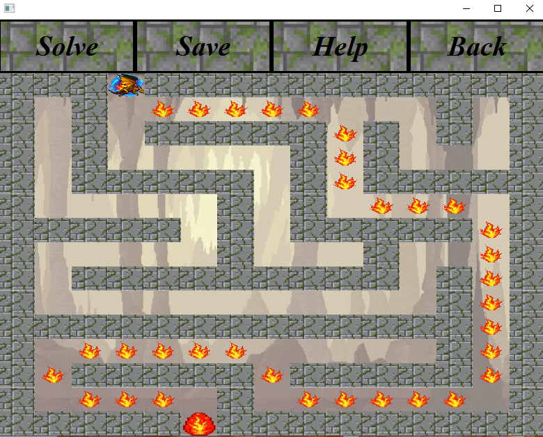
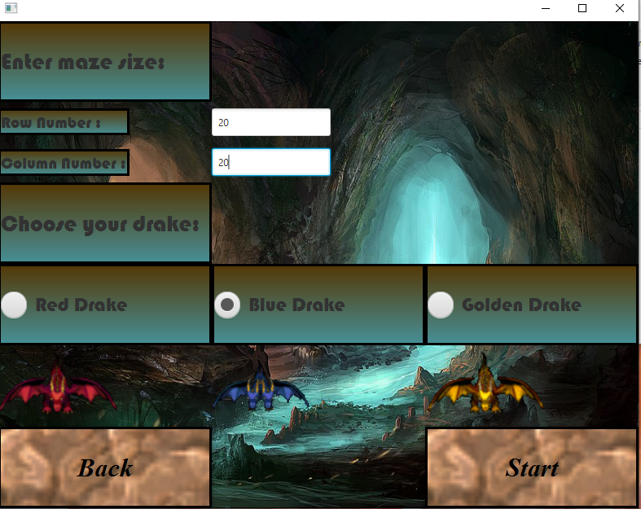

MazeProject

Omer Topchi, Matan Isar.

to run the jar file you need javafx sdk of 21 installed .

quick run through of the app:

    1.when you run the app youll get the following window:

    2.see about button:

    3.see settings of the app,change as you please:

    
    4.you can load your last runs(i saved games named: omer,omer1):

    5.you can open saved game:

    6.you can solve mazes with the button "solve" in game menu, it then will show the path to victory with alert message:

    7.after clicking "new game" from main menu you'll see this window,
      you can change settings like size of maze and so on:

    
    8.the new game will be showed and you can save the game from here:

